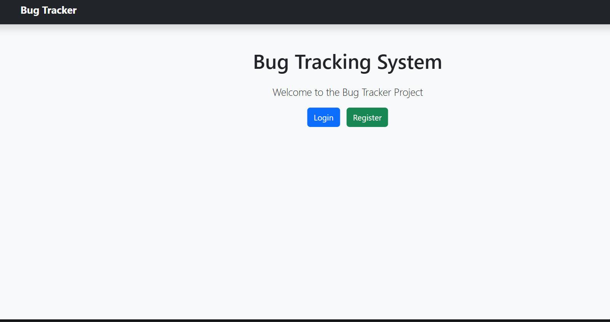
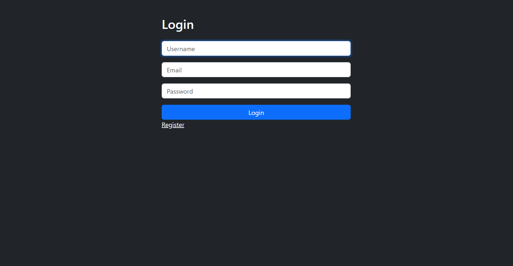
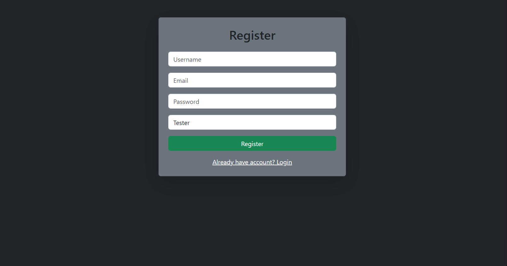
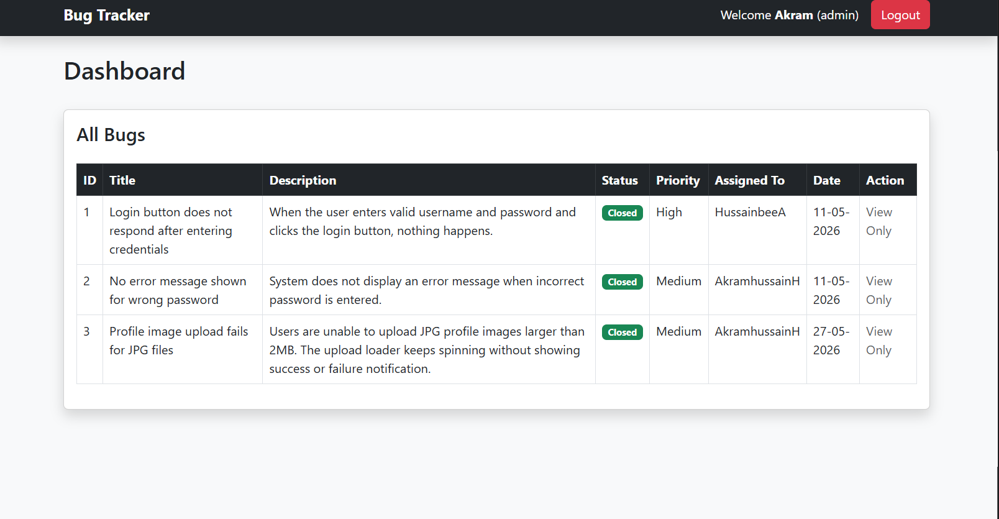
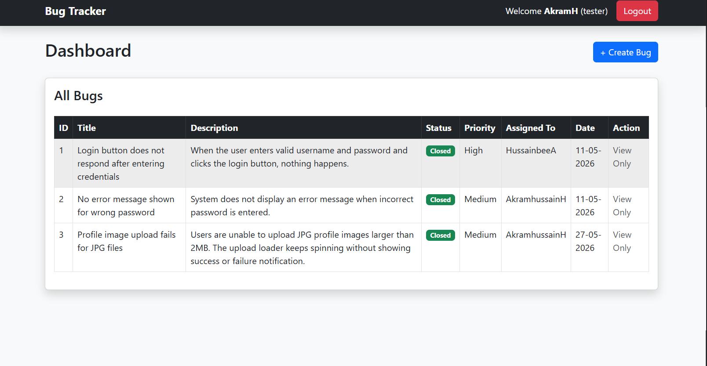
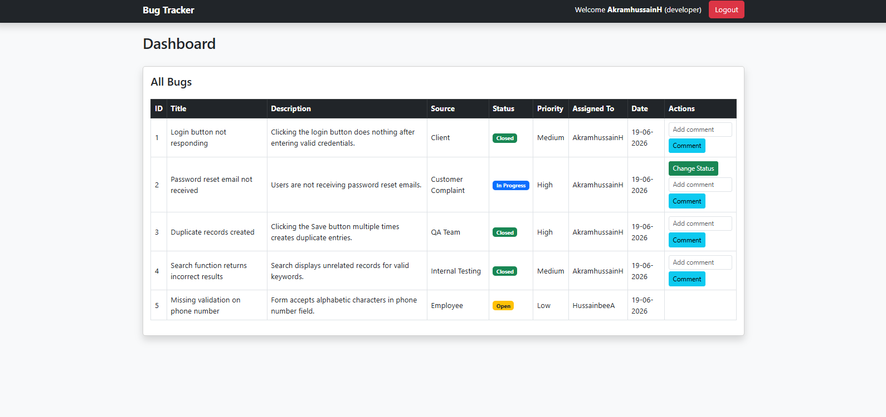

## API Bug Tracker System

## Project Overview

The API Bug Tracker System is a web-based application designed to efficiently track, manage, and resolve software bugs in API-based projects. It provides a structured workflow between Admin, Tester, and Developer roles, along with a user-friendly interface for better collaboration.

This system improves debugging efficiency, enhances communication between teams, and ensures faster issue resolution.

# Live Demo

##  https://api-bug-tracker-system.onrender.com

## Features

###  Authentication System
- User Registration Page  
- Secure Login Page  
- Email notification alerts  

###  Tester Panel
- Report new bugs  
- View assigned test cases  
- Track bug status  

###  Developer Panel
- View assigned bugs  
- Update bug status (Open / In Progress / Resolved)  
- Add resolution comments  
- Track development progress  

###  Admin Panel
- Manage users (Tester / Developer)  
- Assign bugs to developers  
- Monitor system activity  
- View all bug reports  

###  User Interface (NEW)
- Clean and responsive UI design  
- Easy navigation across modules  
- Quick access dashboard  
- Improved usability for all roles  

## Screenshots

###  User Interface



###  Login Page



###  Register Page



###  Admin Dashboard



###  Tester Dashboard



###  Developer Dashboard



## Tech Stack

```text
Backend
│
├── Python
└── Flask

Frontend
│
├── HTML5
├── CSS3
├── JavaScript
└── Bootstrap

Database
│
└── MySQL

Tools & Platforms
│
├── Git
├── GitHub
└── VS Code
```

## Project Structure


```text
API-bug-tracker-system/
│
├── app.py
├── requirements.txt
├── README.md
│
├── static/
│
├── templates/
│   ├── login.html
│   ├── register.html
│   ├── admin.html
│   ├── tester.html
│   └── developer.html
│
└── screenshots/
    ├── login_page.png
    ├── register_page.png
    ├── admin_page.png
    ├── tester_page.png
    ├── developer_page.png
    └── user_interface.png
```

## Installation Guide

# Clone repository
git clone https://github.com/chussainbee2026-commits/API-bug-tracker-system.git

# Move to project folder
cd API-bug-tracker-system

# Install dependencies
pip install -r requirements.txt

# Run project
python app.py

## Roles & Access
Role	   Permissions
Admin	   Full control over system
Tester	   Report and track bugs
Developer  Fix and update bug status

## Future Improvements

API integration with CI/CD tools

File upload support

## Author

### Hussain bee & Akram Hussain

Aspiring Software Developer passionate about:

Python Development | Web Technologies | AI Development | Artificial Intelligence


#  GitHub Support

If you like this project, give it a * on GitHub and support the repository.
